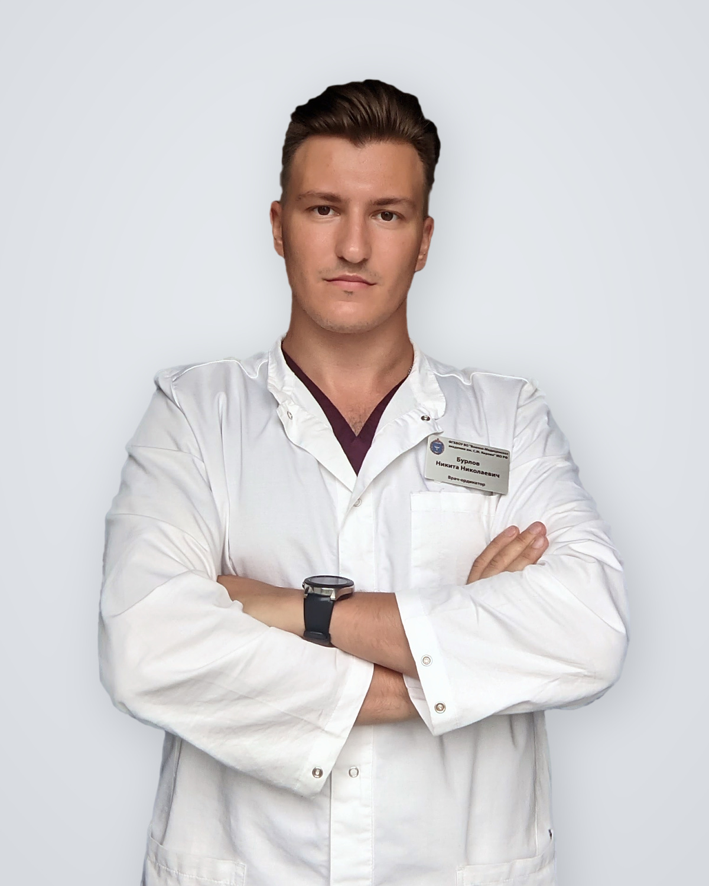

::: {.hero}
::: {.hero-copy}

## Бурлов Никита Николаевич

Врач-хирург (по образованию), интересуются и занимаюсь доказательной медициной, клинической эпидемиологией, методологией клинических исследований, биостатистикой, программированием на языке R. Организатор онлайн журнального клуба "Base of evidence-based medicine". Препадаю на онлайн-программе переподготовки «Биостатистика и анализ медицинских данных».\
А еще душнила, токсик, диктатор, тролль в комментариях, пугаю врачей, ставлю какашки, бананы и хот доги под постами и тот, к кому невозможно относиться нейтрально.

::: {.hero-actions}
[Читать блог](blog.qmd){.btn .btn-primary}
[Связаться](contacts.qmd){.btn .btn-outline-primary}
:::
:::

::: {.hero-photo}

:::
:::

## Основные направления

::: {.card-grid}
::: {.info-card}
### Статистический анализ

Планирование анализа, выбор методов, воспроизводимый анализ данных и понятное представление результатов.
:::

::: {.info-card}
### Методология

Помощь с дизайном клинического исследования, формулировкой задач и согласованием методов с исследовательским вопросом.
:::

::: {.info-card}
### Образование

Журнальный клуб, разбор научных публикаций, лекции, мастер-классы и практические материалы по биостатистике.
:::
:::

## Где меня читать и смотреть

::: {.social-grid}
[**Telegram-канал Ebm_base**](){.social-card}

[**Instagram-канал Ebm_base**](){.social-card}

[**Telegram-канал Журнального клуба**](){.social-card}

[**Группа ВК Журнального клуба**](){.social-card}

[**YouTube-канал Журнального клуба**](){.social-card}
:::

