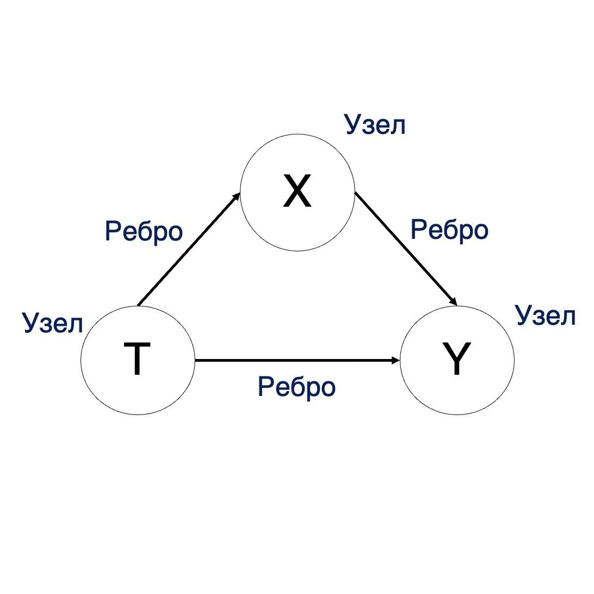
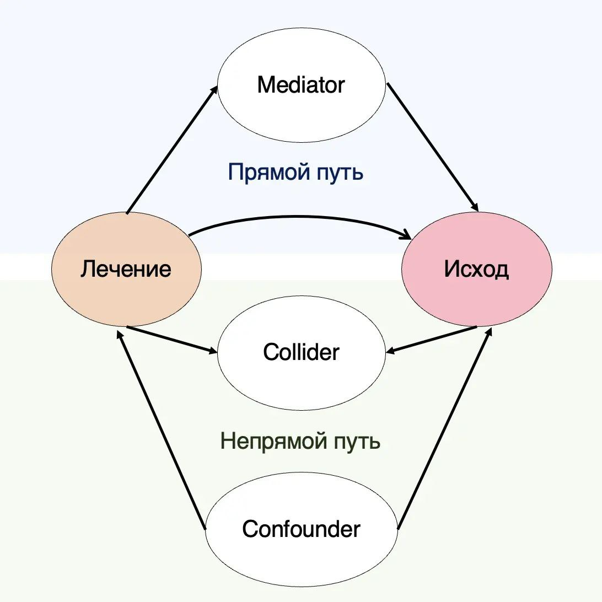

При проведение клин исследований необходимо учитывать много переменных, помимо лечения и исходов. И при стат анализе необходимо учитывать и контролировать некоторые из них, чтобы минимизировать различные bias и смещение результатов 🤔

❗С этим может помочь прямой ациклический граф (DAG, directed acyclic graph) ❗

Это визуальное отображение потенциальных взаимодействий 🙈
Так как в наших конкретных предположениях имеется упорядоченность во времени, то циклы не возникают (ацикличный) и есть определенное направление (прямой) 👨🏻‍🎓

На @fig-dag-1 видно, что DAG состоит из узлов (факторы) и ребер (связи/стрелочки). По своей сути это лишь абстракция, которая помогает принимать решение🤓

{#fig-dag-1}

В него можно включать как известные факторы с изученным воздействием, так и неизвестные (в т.ч. по которым у нас нет данных) с предположениями о воздействии (жаль, что нам их не проверить 😭)
Выявив визуально потенциальные источники ошибок, мы проводим стат анализ с коррекцией или без (зависит от типа bias/смещения) 🤖

На важно знать, что есть 2 типа пути (@fig-dag-2):\
 🔸 прямой (все стрелки направлены от вмешательства к исходу)\`
 🔸 непрямой (остальные)

{#fig-dag-2}

В идеале у нас должен быть открыт основной прямой путь и закрыты все непрямые (на усмотрение исследователей и некоторые прямые), тогда получим оценку без смещений. Но вот тут и начинаются сложности... 😬
Чтобы закрыть путь когда-то надо проводить коррекцию, а когда-то не надо (большая, сложная и нудная тема, вы же тут не за этим 🙉)

С неизвестными/ненаблюдаемыми факторами мы ничего сделать не можем, только думать и делать выводы👽

И моя любимая рубрика «Ограничения» 🎉 (даже у рисуночков они есть):\
 📍 DAG лишь показывают определенный набор предположений, которые могут быть неверными.\
 📍 Они не отображают величину отклонений или взаимодействие со случайными ошибками.\
 📍 Они могут стать очень сложными (повторяющиеся измерения и прочее), что делает интерпретацию трудоемкой (но мб она отражает опасения о потенциальных bias’ах?).

Как думаете, должно это внедриться в практику и стать нормой при публикации результатов?