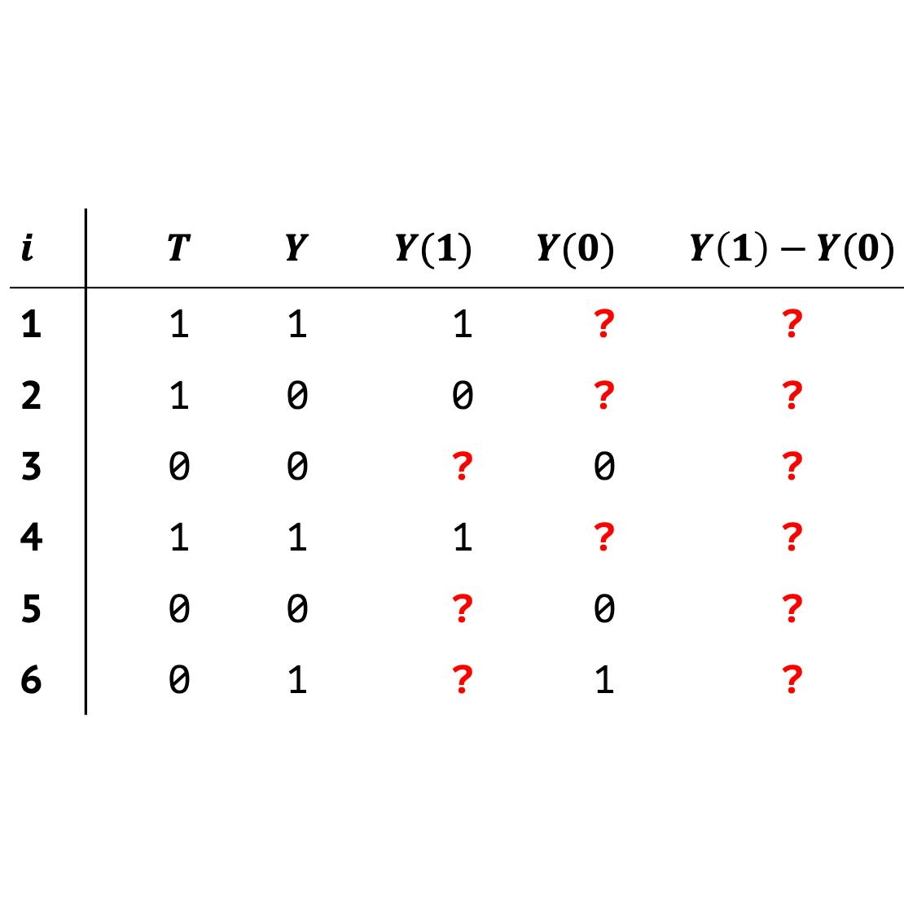
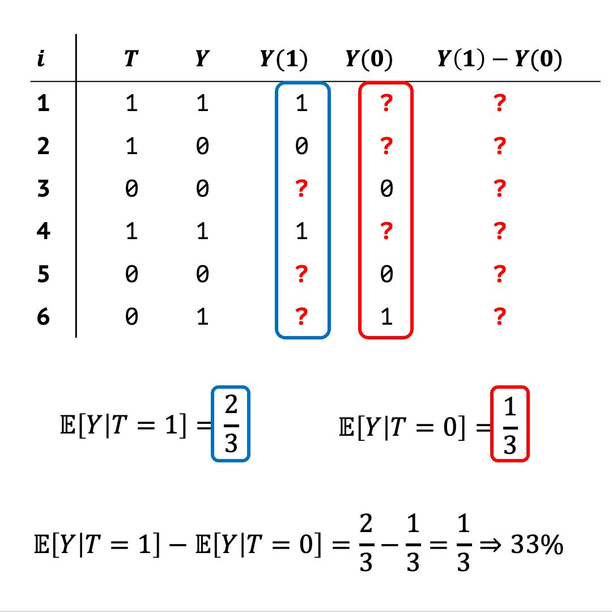

Хочу вступить на скользкую дорожку и затронуть непростую тему

В подходе causal inference (причинно-следственный вывод) мы сталкиваемся с термином ATE. Но прежде, чем дойти до него, нужна вводная информация.

Итак, у каждого объекта/человека/пациента можно указать, было воздействие/лечение ($T = 1$) или нет ($T =0$), где $T$ - treatment. Также можно узнать был ли исход, который нас интересует ($Y = 1$ или $Y = 0$), где $Y$ - outcome. 

Спойлер, тут будут абстрактные показатели. Если вам удобнее/понятнее конкретные, то подставляйте под них свои показатели: $T$ - дали конкретное лекарство или нет, $Y$ - выздоровел пациент или нет и т.д. и т.п.

Мы предполагаем, что помимо наблюдаемого исхода (тот как мы увидели при конкретном $T$ у конкретного пациента), есть ещё [потенциальный исход (potential outcome)](https://www.tandfonline.com/doi/abs/10.1198/016214504000001880). Он возникает, если бы объект попал в другую группу (не в $T = 1$, а в $T = 0$ или наоборот), т.е. словно в контрфактуальный мир (а вы думали паралельные вселенные - это шутка?). Если бы мы могли такое померить, то для каждого объекта можно было бы получить **ITE (individual treatment effect, индивидуальный эффект лечения)**:

$ITE = Y(1) - Y(0)$ , где

$Y(1)$ - исход при $T = 1$\
$Y(0)$ - исход при $T = 0$

Но заглянуть в параллельную реальность мы не можем 🌚 (особенных людей в счёт не берем, их ещё инопланетяне похищают)

И вот мы столкнулись с фундаментальной проблемой причинно-следственного вывода, т.к. для каждого объекта у нас всегда контрфактуальный исход неизвестен (NA), а значит и ITE = NA (подробнее в таблице на @fig-ITE).

{#fig-ITE}

Что делать?

Придется уйти от индивидуальных оценок и перейти к усреднённым. Вот здесь мы и сталкиваемся с **ATE (average treatment effect, средний эффект лечения)**

1) Мы считаем мат. ожидание исхода при $T = 1$ и $T = 0$
2) Из мат. ожидания при $T = 1$ вычитаем мат. ожидание при $T = 0$, получаем ATE

В формулах это выглядит так (а при помощи таблицы на @fig-ATE):

{#fig-ATE}

$ATE = 𝔼[Y(1) - Y(0)] = 𝔼[Y(1)] - 𝔼[Y(0)] = 𝔼[Y|T =1] - 𝔼[Y|T = 0]$

Такой вариант мы можем получить в идеальных условиях в РКИ (все следуют лечению). В остальных случаях у нас возникают особенности и [расчет других мер эффекта](https://bookdown.org/mike/data_analysis/types-of-treatment-effects.html)

Но, как и в других случаях, у нас есть предположения:\
- Условная взаимозаменяемость/conditional exchangeability (об этом уже писал [здесь](https://t.me/ebm_base/872)) или отсутствие ненаблюдаемого конфаундинга ([здесь](https://t.me/ebm_base/50))\
- Позитивность/positivity (важно, что принадлежность объектов к каждой группы была ненулевой или $0 < P(T = 1|X = x) < 1$, где $X = x$ - другие ковариаты)\
- Стабильность/consistency (это относится к четкому определению вмешательства, т.е. мы должны четко понимать, что означает $T = 1$ и $T = 0$, не должно быть размывчатых формулировок. Что дает нам понимание, что исход равен тому значению, которое мы наблюдаем)\
- Невмешательство/no interference (наше вмешательство на один объект не должно влиять на другой. Но что-то мне кажется это предположение нужно обсуждать отдельно, т.к. не очень уверен в терминах)\
- Еще есть страшное слово SUTVA, которое словно объединяет 3 и 4 пункты (но не уверен)

От понимания ATE уже идет переход к другим мерам (ATT, ATC, CATE, LATE и т.п.). Добро пожаловать в мир причинно-следственного вывода 😎