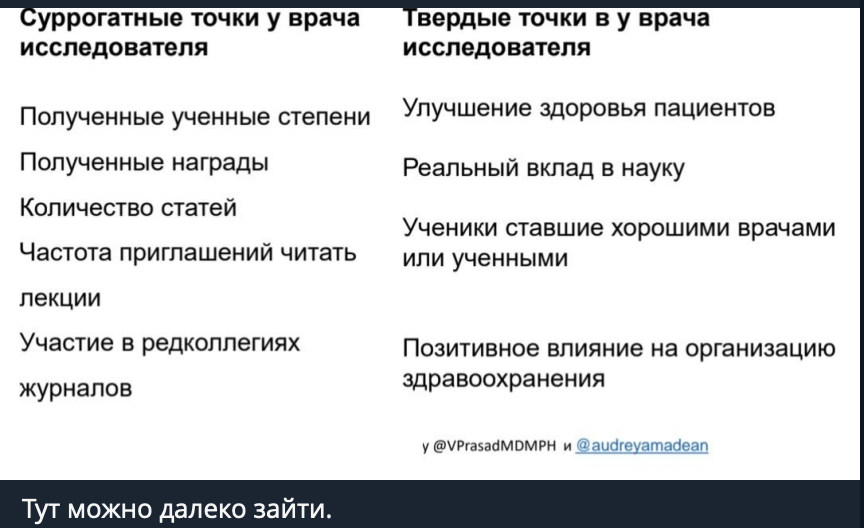

# Мои размышления

В последнее время мне попадается немало каналов, где "простым языком" для "обычных врачей" авторы хотят объяснить методы или логику статистики. Если намеренно поискать, то таких найдется ещё больше.

Конечно над этим забавно смеяться, их душнить, давать волю своей токсичной натуре. Но я задумался. А мб у подобной тактики есть преимущества? И какие проблемы, на мой взгляд, это создаёт?

Мои размышления о **плюсах** этих сообществ/каналов:\
1. Они дают неплохой старт для дальнейшего погружения в статистику. Я сам начинал с подобных курсов (многие встречали - это "Основы статистики" от Анатолия Карпова). В начале кажется ничего непонятно, ты ещё не осознаешь глубину этого айсберга, не знаешь об ошибках в них. Затем кажется, что ты становишься почти гуру (добро пожаловать на пик глупости). А после небольшого погружения ("приключение на 20 минут") осознаешь как сильно ты ошибался. И продолжаешь это погружаться постепенно все глубже и глубже.\
2. Потенциально снижают тревожность перед "страшным миром статистики". Область статистического анализа кажется страшной и суровой, пока не начинаешь осознавать логику. А когда находишь людей, которые готовы помогать в изучении (а сейчас их много, на разных уровнях), то становится уже спокойнее. Ведь ты знаешь, что всегда можно обратиться за помощью.\
3. Знакомят с инструментами статистического анализа. Когда-то считали на бумаге, затем простые вычисления отдали компьютеру. Сейчас у нас уже достаточно мощный технологический потенциал, при котором очень многие расчёты выполняются только с помощью машин. А интерфейс делают более удобным для пользователя. Когда вам показывают, что нужно установить только 1-2 ПО, в нем внутри почти всё на кнопках (IDE для языков программирования не рассматриваем), то это вселяет уверенность, что с этим можно справиться.\
4. Мотивация. Не скажу, что этот пункт мне нравится, но некоторые люди после подобных курсов хорошо заряжаются, чтобы продолжить обучение в сторону статистики.

Но о **недостатках** я думаю чаще (и скорее всего чаще говорю о них же):\
1. Поверхностность. Это обратная сторона старта. Мы, конечно, проходили в школе математику с элементами мат. анализа (но кто это помнит сейчас?). У врачей нет времени на погружение. Материала действительно много, и он сложный. Поэтому приходится упрощать (даже на сложных курсах). Цена этому - искажение при передачи смысла. Я сам многие вещи знаю достаточно поверхностно, по своему мнению. У меня есть целые области с пробелами. Поэтому на начальном уровне останавливаться нельзя. Надо быть готовым при необходимости углубляться дальше в материал.\
2. Упрощение и искажение. Как я уже написал выше, мы все делаем упрощения в той или иной степени. Чтобы понять самому, чтобы объяснить другому, чтобы интерпретировать. И здесь нужно стараться как в школе, чтобы упрощение минимально искажало смысл идеи. Иначе какой смысл в ее изучение. Наиболее яркий пример - определение p-value (чтобы не повторяться, прикреплю определения, которые нашел ИИ).\
3. Увеличение числа "экспертов". Проблема из серии "я научу вас как зарабатывать миллионы - купите мой курс". Часто это следует из 1 и 2 пунктов недостатков. Авторы рассказываю как легко проводить статистический анализ, как несложно интерпретировать его результаты. Поэтому в отношении таких я использую хештег #СТАТИСТИКА_ПРОСТО, потому что когда-то от известных в онкологических кругах людей была реклама в духе "о сложном просто" (они так рекламировали курсы по статистике). Особенно сильно растет число "экспертов", которые все это делают с помощью LLM (или ИИ в быту), не осознавая как и почему он даёт ответы.\
4. Заработок на доверчивых людях. Нет ничего плохого, чтобы получать деньги за работу (мы все так работаем, альтруизм уже давно не в почёте). Но должна быть качественная работа, а не фантики с воздухом. Люди приходят с проблемой, им обещают "сейчас мы вас научим статистике", "сделаем экспертами в клинических исследованиях", "проведем лучший стат. анализ". А на деле? Схема марафона желаний.В действительности обучение статистическому анализу - это сложно, долго и тяжело.\
5. Ошибки. Мы хотим, чтобы наука в России стала великой, поднялась с колен, чтобы мы могли ею гордиться. По факту, за долгое время мало что меняется, кроме единичных случаев (там, где нас нет, тоже схожая ситуация). И это логично, потому что это зависит не только от авторов или статистиков. Это большая структура, где много участников. Но добавлять в это свои ошибочные и самоуверенные предположения, а потом жаловаться, что вот все плохо или мне мешают/критикуют - ту мач (можете иначе назвать).

Все, что выше, это мои размышления (некоторые я не знаю как структурировать лучше). Вы можете с ними быть согласны или нет, ваше право. Вы можете указать другие плюсы и/или минусы.\
Однако я решил, что вешать на себя белое пальто - признак дурного тона, поэтому немного подумал, а что я делал или делаю сейчас...

Страдаю ли я излишней самоуверенностью? Да. Особенно, когда я занимаюсь любимым делом троллингом. Я могу прибегать к радикальным формулировкам, выражениям. В работе же я стараюсь искать подтверждения или опровержения своим идеям, знаниям. Находить обоснования того или иного метода.

Делал ли я ошибки? Да, уверен до сих пор! Особенно, когда на мою работу посмотрят более компетентные люди.

Горжусь этим? Нет. Зачем?

Выставляю все это на показ? Нечего выставлять. Мне важно работать с людьми, решать сложные и интересные задачи, а не демонстрировать отзывы или рассказывать о моем "величии".

Оправдываю свои ошибки? Не совсем. Часто на тот момент у меня не было достаточно знаний - это ок. Иногда приходят с запросом "давайте сделаем просто" - это тоже ок (с оговорками). Дальше я стараюсь не останавливаться, а изучать новое, выслушивать критику, больше узнавать и пробовать, не повторять своих же ошибок.

И в меру своих возможностей где-то об этом рассказывать. В первую очередь, что статистика - это интересная, но сложная и тяжёлая область.  А дальше каждый делает выбор сам.

# Комментарии от Мареева Ю.В.

## Первый

Крайне интересные два поста и дискуссия к ним.

Мне кажется, что прежде чем обсуждать, что должно или не должно входить в курс по статистике и обсуждать качество курсов, нужно ответить на более фундаментальный вопрос: чему именно мы хотим научить врача?

Я вижу как минимум три разные аудитории.

1. Врач, который не занимается исследованиями, но регулярно читает статьи, клинические рекомендации и слушает лекции.

2. Врач-исследователь, который сам не проводит статистический анализ, но планирует исследование, набирает пациентов, обсуждает дизайн со статистиком и интерпретирует готовый отчет.

3. Врач-исследователь, который планирует самостоятельно анализировать данные.

Очевидно, что это три разные образовательные задачи.

Честно говоря, у меня нет готового ответа ни для первой, ни для второй группы, и тем более для третьей.

Но если говорить о первом уровне, то из опыта работы с ординаторами мне кажется важным понимание следующих вещей.

1. Что означает p-value и чего оно не означает. Почему в первую очередь мы смотрим на первичную конечную точку.

2. Почему статистическая значимость не равна клинической. Что такое Number Needed to Treat (NNT) и почему он тоже не является универсальным показателем.

3. Что множественные сравнения увеличивают вероятность ложноположительных результатов. Почему при большом числе вторичных конечных точек p = 0,05 уже нельзя интерпретировать так же, как при одном сравнении. Почему в описательной статистике p-значения в ряде журналах вообще не используют.

4. Зачем нужны поправки на множественные сравнения, иерархия конечных точек и почему в некоторых исследованиях используют win ratio.

5. Как на базовом уровне интерпретировать кривые Каплана-Мейера.

6. Для чего нужны регрессионные модели. Понимать, что авторы могли преследовать разные цели: оценить причинно-следственные связи, построить прогностическую модель или просто сделать модель ради модели [последнее разумеется то чего лучше не делать]. 
Я бы тут еще a) про casual inference рассказал бы и привел пример парадокса ожирения. b) сказал бы что не все что называется прогностической моделью является адекватной прогностической моделью и про внешнюю валидизацию. 

7. Что данные могут иметь разные распределения. Когда данные лучше описывать средним значением, а когда медианой и 25-м и 75-м процентилями.

8. Какие ограничения есть у подгрупповых анализов.

9. Что такое статистическая мощность исследования. Как, читая статью, можно прикинуть, было ли включено достаточно пациентов. Понятно, что здесь придется объяснять доверительные интервалы, еще раз говорить о клинической значимости, приводить примеры и честно сказать, что простого алгоритма здесь нет.

10. Как интерпретировать чувствительность и специфичность тестов и почему без учета распространенности заболевания они могут вводить в заблуждение.

11. Типы исследований. Что такое рандомизация и ослепление и зачем они нужны. Типы наблюдательных исследований. Что можно и чего нельзя узнать из последних. 

12. Что такое разные виды bias с примерами. Что важно понимать какие пациенты попали в работу и и нет ли тут immortality bias и т.д. 

13. Что такое мета-анализ и основы его интерпретации. 

А что думаете вы? Что бы вы добавили в этот список? Что, наоборот, считаете лишним для врача, который не делает исследований и только читает статьи и слушает лекции

## Второй

{#fig-comment}