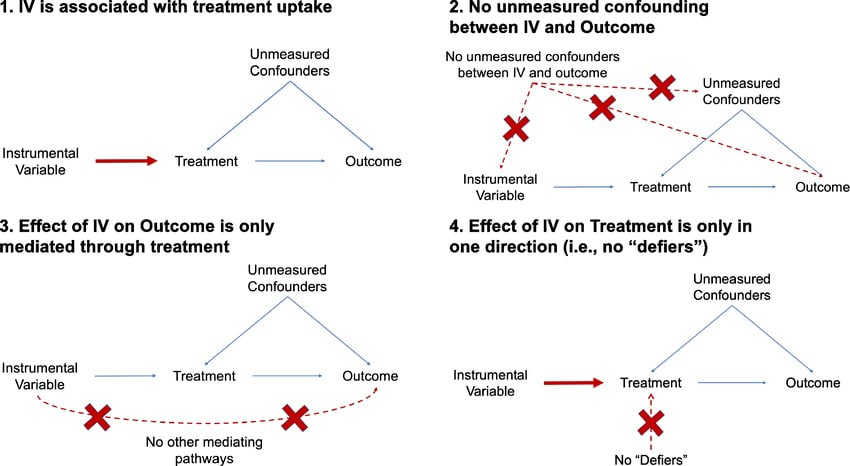

Давайте представим, что у вас получилось собрать данные реальной клинической практики - real-world data (RWD. Сами вели свою таблицу Excel, ведь они так собираются).

Вы планируете сравнить методы лечения (препарат А против В) по исходу (пациент выписался или умер). Но слышали/знаете, что есть такое явление, как confounding. Он может реализовываться через множество факторов. Но предположение о модели ведёт к тому, что факторов, которые надо включить, очень много (а мб каких-то нет в данных - скрытые). Что делать?

Можно присмотреться к методу из causal inference, который называется инструментальная переменная (instrumental variable, IV) [[1](https://miguelhernan.org/whatifbook), [2](https://theeffectbook.net/ch-InstrumentalVariables.html)].

В чем суть?\
Мы подбираем такую переменную/фактор (инструмент), которая:\
- связана с назначением лечения (релевантность)\
- не связана с исходом (кроме связи через назначение лечения)\
- не связана с другими (особенно скрытыми) факторами, которые влияют на исход (экзогенность) [[1](https://miguelhernan.org/whatifbook), [2](https://theeffectbook.net/ch-InstrumentalVariables.html), [3](https://pmc.ncbi.nlm.nih.gov/articles/PMC4201653/#S1)]

Визуально это можно отобразить на [DAG](https://t.me/ebm_base/131)

Если эти предположения не нарушены (и основные для оценки [ATE](https://t.me/ebm_base/933)), то мы можем использовать выбранный показатель в качестве инструментальной переменной. А дальше с помощью двухэтапных методов (есть и другие подходы) это учитываем в окончательной модели [[2](https://theeffectbook.net/ch-InstrumentalVariables.html)].

Что нам это даёт?\
Мы получаем оценку LATE-IV, т.е. локальный средний эффект лечения среди "послушных" (об этом разделении я расскажу в других постах) [[4](https://www.soc4m.ru/index.php/soc4m/article/view/VCXNGL)]. 

$LATE-IV = 𝔼[Y|T = 1, U = c] - 𝔼[Y|T = 0, U = c]$

где:\
$𝔼$ - мат ожидание\
$Y$ - исход\
$T$ - лечение (1 - препарат А, 0 - препарат В)\
$U$ - фиктивная переменная "послушания" (c - "послушные")

К сожалению, если нам недоступна оценка ATE (а часто это так), то оценка LATE - это оправданный шаг (но это меняет эстиманд - мы оцениваем эффект у тех, кто следовал назначенному лечению). Может показаться, что это похоже на per protocol анализ (об этом и применение IV в РКИ я тоже расскажу в следующих постах) [[4](https://www.soc4m.ru/index.php/soc4m/article/view/VCXNGL)].

Как пример, можно ознакомиться с [этой статьей](https://pmc.ncbi.nlm.nih.gov/articles/PMC5969097/pdf/ADD-113-1105.pdf). В ней оценивали назначение Варениклина на смертность от всех причин через 2 года после назначения терапии. В качестве инструмента использовали склонность врача назначать варениклин (количество рецептов на варениклин, выписанный 7 предыдущим пациентам).  Итог: RD = 0.67% (95% CI –0.11; 1.46%) на 100 пролеченных пациентов. Клинически не выражен, статистически не значим. 

Пока писал пост, понял, что нужно будет еще раскрыть некоторые особенности (кто такие "послушники" и "непослушники", IV в РКИ, методы, что-то еще). Поэтому буду пока это разбирать...
